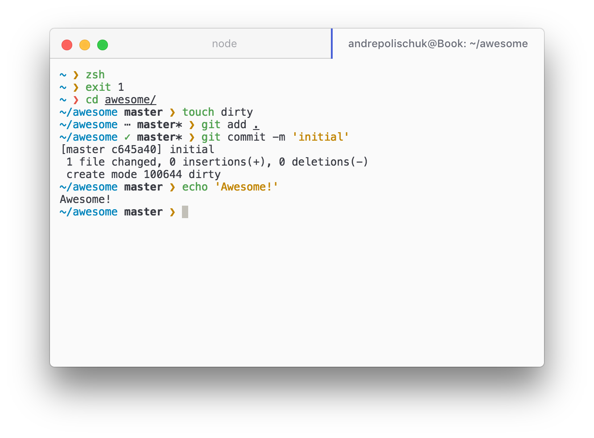
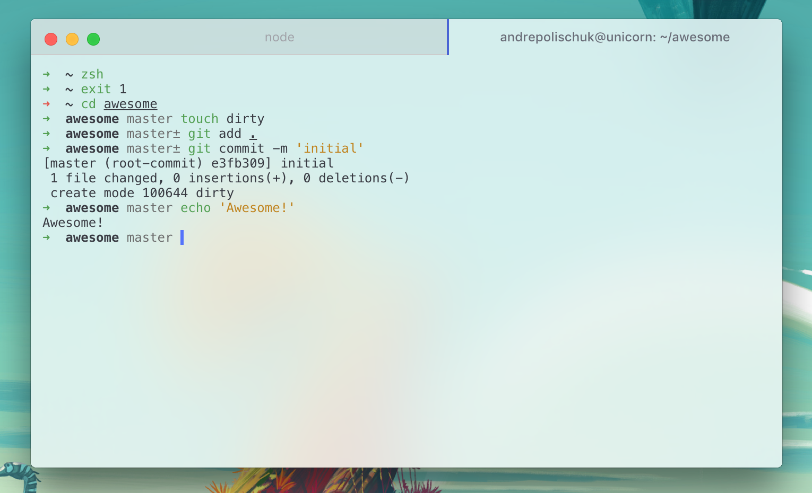

# hyper-one-light

> [Atom One Light][one-light] theme for [Hyper][hyper]



## Install

Open your Hyper preferences and add `hyper-one-light` to plugin list:

```js
plugins: [
  'hyper-one-light'
],
```

## Vibrancy



Add follows line to config for enable the light vibrancy effect:

```js
enableVibrancy: true
```

## Highlight active pane

[hyper-simple-highlight-active-session][] works perfectly fine to highlight active pane.

[hyper-simple-highlight-active-session]: https://github.com/matheuss/hyper-simple-highlight-active-session


## Tips

In the screenshot hyper-one-light is running with [min][min] prompt and Menlo font.

To colorize commands as in the screenshot, install [zsh-syntax-highlighting][zsh-syntax-highlighting].

## License

MIT

[one-light]: https://github.com/atom/one-light-syntax
[hyper]: https://hyper.is
[min]: https://github.com/andrepolischuk/min
[zsh-syntax-highlighting]: https://github.com/zsh-users/zsh-syntax-highlighting
